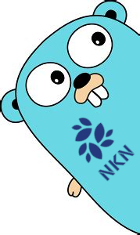

<p align="center"></p>

[](https://pkg.go.dev/github.com/omani/nkn-wallet)


# nkn-wallet
A next generation NKN wallet with built-in age encryption and NKN OpenAPI support.

nkn-wallet is a library that implements [nkn-sdk-go](https://github.com/nknorg/nkn-sdk-go) with a new wallet functionality utilizing age encryption and using the [NKN OpenAPI](https://github.com/rule110-io/nkn-open-api) for querying the NKN blockchain.

Upcoming releases will include the possibility for encryption by SSH public key ("ssh-ed25519 AAAA...", "ssh-rsa AAAA...") stored on disk or by fetching the keys from a Github user profile (github.com/[user].keys).

---

While nkn-wallet has its own wallet implementation the underlying SDK functionality remains the same and is compatible with nkn-sdk-go. The move to age as an encryption toolkit results in overall less loc since there is no need to implement scrypt functionality manually. This wallet implementation uses age's internal scrypt feature which is identical to the original NKN wallet implementation performance-wise and slightly enhanced security-wise through the use of an additional layer, that is, the derived scrypt key being encrypted again with a [ChaCha20-Poly1305](https://pkg.go.dev/golang.org/x/crypto/chacha20poly1305) [AEAD](https://en.wikipedia.org/wiki/Authenticated_encryption#Authenticated_encryption_with_associated_data_(AEAD)).

---


Features:
* Manage all your different accounts from a central place
* State-of-the-art encryption with [Age](https://github.com/FiloSottile/age)
* Manage multiple accounts in a single wallet file (multiwallet capability)
* List all your accounts
* Set an alias for your account
* Show the balance of your account
* Show transactions of your account
* Move funds between accounts in the wallet
* Transfer funds to another NKN address
* Restore your accounts
* Change password of your account
* Change or set alias of your account
* NKN OpenAPI support

# Library
## Installation
`import nknwallet "github.com/omani/nkn-wallet"`

## Example
```go
package main

import (
	"fmt"
	"log"

	"github.com/nknorg/nkn-sdk-go"
	nknwallet "github.com/omani/nkn-wallet"
)

func main() {
	passwd := []byte("secretpassword")
	store := nknwallet.NewStore("mywallet.json")

	walletcfg := &nkn.WalletConfig{}
	wallet, err := store.NewWallet(passwd, "my-new-shiny-account", walletcfg)
	if err != nil {
		log.Fatal(err)
	}

	// save new wallet to store (otherwise it is in-memory only)
	store.SaveWallet(wallet)

	// list wallets in store
	store.ListWallets()

	// get balance of newly created account
	balance, err := wallet.OpenAPI().GetBalance()
	if err != nil {
		log.Fatal(err)
	}
	fmt.Printf("Address: %s - Balance: %s NKN\n", wallet.Address(), balance)

	// fetch a wallet from store
	wallet, err = store.GetWalletByAlias("my-new-shiny-account", passwd)
	if err != nil {
		log.Fatal(err)
	}

	// print account address
	fmt.Printf("Address of account: %s\n", wallet.Address())

	// get transactions associated with account
	txn, err := wallet.OpenAPI().GetTransactions()
	if err != nil {
		log.Fatal(err)
	}
	if len(txn.Data) == 0 {
		fmt.Println("Account has no transactions.")
		return
	}

	for _, tx := range txn.Data {
		fmt.Printf("Sent %s NKN to address %s", tx.Payload.Amount, tx.Payload.RecipientWallet)
	}
}
```

### Use with nkn-sdk-go
```go
package main

import (
	"crypto/rand"
	"encoding/hex"
	"fmt"
	"log"
	"time"

	"github.com/nknorg/nkn-sdk-go"
	nknwallet "github.com/omani/nkn-wallet"
)

func main() {
	store := nknwallet.NewStore("mywallet.json")

	walletcfg := &nkn.WalletConfig{}
	wallet, err := store.NewWallet([]byte("secretpassword"), "my-new-shiny-account", walletcfg)
	if err != nil {
		log.Fatal(err)
	}

	// continue to use nkn-sdk-go as usual
	err = func() error {
		// get the underlying nkn.Account
		account := wallet.Account()

		fromIdentifier := make([]byte, 8)
		_, err = rand.Read(fromIdentifier)
		if err != nil {
			return err
		}
		toIdentifier := make([]byte, 8)
		_, err = rand.Read(toIdentifier)
		if err != nil {
			return err
		}

		fromClient, err := nkn.NewMultiClient(account, hex.EncodeToString(fromIdentifier), 4, false, nil)
		if err != nil {
			return err
		}
		defer fromClient.Close()
		<-fromClient.OnConnect.C

		toClient, err := nkn.NewMultiClient(account, hex.EncodeToString(toIdentifier), 4, false, nil)
		if err != nil {
			return err
		}
		defer toClient.Close()
		<-toClient.OnConnect.C

		time.Sleep(time.Second)

		timeSent := time.Now().UnixNano() / int64(time.Millisecond)
		var timeReceived int64
		go func() {
			msg := <-toClient.OnMessage.C
			timeReceived = time.Now().UnixNano() / int64(time.Millisecond)
			isEncryptedStr := "unencrypted"
			if msg.Encrypted {
				isEncryptedStr = "encrypted"
			}
			log.Println("Receive", isEncryptedStr, "message", "\""+string(msg.Data)+"\"", "from", msg.Src, "after", timeReceived-timeSent, "ms")
			// []byte("World") can be replaced with "World" for text payload type
			msg.Reply([]byte("World"))
		}()

		log.Println("Send message from", fromClient.Address(), "to", toClient.Address())
		// []byte("Hello") can be replaced with "Hello" for text payload type
		onReply, err := fromClient.Send(nkn.NewStringArray(toClient.Address()), []byte("Hello"), nil)
		if err != nil {
			return err
		}
		reply := <-onReply.C
		isEncryptedStr := "unencrypted"
		if reply.Encrypted {
			isEncryptedStr = "encrypted"
		}
		timeResponse := time.Now().UnixNano() / int64(time.Millisecond)
		log.Println("Got", isEncryptedStr, "reply", "\""+string(reply.Data)+"\"", "from", reply.Src, "after", timeResponse-timeReceived, "ms")

		// wait to send receipt
		time.Sleep(time.Second)

		return nil
	}()
	if err != nil {
		fmt.Println(err)
	}

}

```

# CLI App
This package comes with a CLI app in `cmd/`

## Installation
`go install github.com/omani/nkn-wallet/cmd/nkn-wallet@latest`

## Usage
### Invocation
```
$ nkn-wallet
nkn-wallet v1.0
---------------------------------------------------------------------------
nkn-wallet is a library that implements nkn-sdk-go with a new wallet
functionality utilizing age encryption and using the NKN OpenAPI for
querying the NKN blockchain.

Upcoming releases will include the possibility for encryption by
SSH public key ("ssh-ed25519 AAAA...", "ssh-rsa AAAA...") stored on disk
or by fetching the keys from a Github user profile (github.com/[user].keys).

URL: https://github.com/omani/nkn-wallet
MIT license. Copyright (c) 2023 HAH! Sun

[This message will be removed with the next version]
---------------------------------------------------------------------------

Usage:
  nkn-wallet [command]

Available Commands:
  change      Change various information of an account in the wallet
  create      Create an account in the wallet
  delete      Delete an account from the wallet
  help        Help about any command
  list        List all accounts of the wallet
  move        Move funds between accounts in the wallet
  restore     Restore an account from a seed
  show        Show various information to an account in the wallet
  transfer    Transfer funds to another NKN address

Flags:
  -h, --help          help for nkn-wallet
      --ip string     DNS/IP of NKN remote node (default "mainnet-seed-0001.org")
  -p, --path string   path to wallet file (default "./nkn-wallet.json")
  -v, --version       version for nkn-wallet

Use "nkn-wallet [command] --help" for more information about a command.
```

### Create account
```
$ nkn-wallet --path usethiswallet.json create --alias mining-wallet-srv01 -s
Password:
Re-enter Password:

Account information:
Seed: c2017a52472f4e616b1ee028297c8609d09fdec90db8522b978df85df9a14d10
Address: NKNT43Q5z863qL2wdheRqEmSgPtNDnbiLTw3
Alias: mining-wallet-srv01
Account saved successfully.
```
**Note:** Use the `-s` flag to save the newly created account to the wallet!

### Create another one
```
$ nkn-wallet --path usethiswallet.json create --alias github-donations -s
Password:
Re-enter Password:

Account information:
Seed: de392b438d5020b46123f461d0c1db50c2eef244fb6e213c20bfaa3a4b2ae237
Address: NKND1ejSRWBExoq8t4DWpPHaK5BMBe4yifTN
Alias: github-donations
Account saved successfully.
```
**Note:** Use the `-s` flag to save the newly created account to the wallet!

### List accounts
```
$ nkn-wallet --path usethiswallet.json list
────┼─────────────────────┼──────────────────────────────────────
 ID │ ALIAS               │ ADDRESS
────┼─────────────────────┼──────────────────────────────────────
  1 │ mining-wallet-srv01 │ NKNT43Q5z863qL2wdheRqEmSgPtNDnbiLTw3
  2 │ github-donations    │ NKND1ejSRWBExoq8t4DWpPHaK5BMBe4yifTN
```

### Show account info
```
$ nkn-wallet --path usethiswallet.json show info -i 1
Password:
 ID │ ALIAS               │ ADDRESS                              │ PUBKEY                                                           │ SEED
────┼─────────────────────┼──────────────────────────────────────┼──────────────────────────────────────────────────────────────────┼──────────────────────────────────────────────────────────────────
  1 │ mining-wallet-srv01 │ NKNT43Q5z863qL2wdheRqEmSgPtNDnbiLTw3 │ d9390cfde27fb118c18e70367afb2fc4ffb17d2386c43f5b157b13c34a5b3120 │ c2017a52472f4e616b1ee028297c8609d09fdec90db8522b978df85df9a14d10
```

### Show balance of account
```
$ nkn-wallet --path usethiswallet.json show balance -i 1
 ID │ ALIAS               │ ADDRESS                              │ BALANCE
────┼─────────────────────┼──────────────────────────────────────┼─────────
  1 │ mining-wallet-srv01 │ NKNT43Q5z863qL2wdheRqEmSgPtNDnbiLTw3 │       0
```

### Show transactions of account
For example purposes the wallet shown in this example is a wallet with already several transactions, not the newly created one in the examples above.
```
$ nkn-wallet --path usethiswallet.json show transactions -i 1
Password:
 CREATED AT          │ BLOCK HEIGHT │ TXN HASH                                                         │ SENDER                               │ RECIPIENT                            │       AMOUNT
─────────────────────┼──────────────┼──────────────────────────────────────────────────────────────────┼──────────────────────────────────────┼──────────────────────────────────────┼──────────────
 2023-08-05 01:58:55 │    5666741   │ 26d7c4e968a4b40a2773e74c9429b73243210981102471cae7973b3c81558510 │ NKNKQ34u5DeSxfi5VN1HDtG9iuQdhmsxAx7m │ NKNVmZQZcDrgdMJKdgRfz2gn5ZdTAyro5uHm │            0
 2023-08-05 01:49:44 │    5666719   │ b770f948117078ea9e6f07f876e8c359732a8e8fa0fa5e2619b6d5604057f8dc │ NKNKQ34u5DeSxfi5VN1HDtG9iuQdhmsxAx7m │ NKNVmZQZcDrgdMJKdgRfz2gn5ZdTAyro5uHm │            1
 2023-08-05 01:34:33 │    5666683   │ 2854bf89c665caaf393a2fa70e01f3abd861a13f16fc4ff828a14a71524667dd │ NKNVmZQZcDrgdMJKdgRfz2gn5ZdTAyro5uHm │ NKNKQ34u5DeSxfi5VN1HDtG9iuQdhmsxAx7m │            1
 2023-08-02 21:32:56 │    5658789   │ d6005aeb904038b45041ce4680ca11229178053c02c7a585b998b54f6a9b1d59 │ NKNVmZQZcDrgdMJKdgRfz2gn5ZdTAyro5uHm │ NKNVmZQZcDrgdMJKdgRfz2gn5ZdTAyro5uHm │            1
 2023-07-30 19:19:03 │    5647512   │ 43a465187b71e80864d72c4c40140f9e22b587628915be384d36989839d05f04 │ NKNVmZQZcDrgdMJKdgRfz2gn5ZdTAyro5uHm │ NKNVmZQZcDrgdMJKdgRfz2gn5ZdTAyro5uHm │            1
 2023-03-31 14:48:06 │    5205199   │ a095963dc703e3a67829b00c8a3c258b937d826ff653d2469f0cd49c88534847 │ NKNJ8PDyiaJBbJJagiWEZLfpDyeBcxvgCgTu │ NKNVmZQZcDrgdMJKdgRfz2gn5ZdTAyro5uHm │  35.87375384
 2023-03-24 15:12:15 │    5179448   │ d54bc49c200602a5c5b1a7dc58fc7e1bdf5391ebfbf0ef0ad4aada31a6cf2a18 │ NKNVmZQZcDrgdMJKdgRfz2gn5ZdTAyro5uHm │ NKNJebQsifkREcuvGVteiZwcTL8WTxEXdLtb │          300
 2023-03-24 15:07:01 │    5179436   │ c4123b1a842563520e826f6c594cd5b7dbd9b237c043a18cb91b01d73bde29dd │ NKNVmZQZcDrgdMJKdgRfz2gn5ZdTAyro5uHm │ NKNSns2iiMibVUfwmXKC2oLFfeWZoTENiMvk │          300
 2021-12-24 01:41:40 │    3469174   │ 497862b0b28dac959fabc760c3c81ef9077ce0a46b266bf598feb35edad1253c │ NKNRBnhQq4dG68C3XVmEsos2QPaHtN4JiC6V │ NKNVmZQZcDrgdMJKdgRfz2gn5ZdTAyro5uHm │          281
 2021-12-21 07:52:54 │    3458748   │ 8e703cdd54696df94cc11c91163ebcb3c203e85bad8708764ae05132eb0da808 │ NKNToMMXL3W4EQxAZ7ooqgkyzPuHDb52fQJy │ NKNVmZQZcDrgdMJKdgRfz2gn5ZdTAyro5uHm │          100
 2021-12-05 03:33:45 │    3397448   │ 5ee5a1c763d7a1bdb00486fcf176363ac6c1b111b98fdea6277278f113df9a9b │ NKNVmZQZcDrgdMJKdgRfz2gn5ZdTAyro5uHm │ NKNPDgusz7HSnXGcvCqPQsLiqNaGspQoCzbz │           10
 2021-12-05 03:33:00 │    3397446   │ 3719cfee8b7c4c0c34df799120f717b65cff035843e221428ec3021481def1b3 │ NKNVmZQZcDrgdMJKdgRfz2gn5ZdTAyro5uHm │ NKNGuNrjgcLTsRvGpYKfE68Fht4Anbh52aR4 │           10
 2021-12-05 02:22:24 │    3397261   │ e64cf77e46833a1d9e23ca0988b9624b4d7b29f0660fde85277b51937149f955 │ NKNVmZQZcDrgdMJKdgRfz2gn5ZdTAyro5uHm │ NKNJ8PDyiaJBbJJagiWEZLfpDyeBcxvgCgTu │           10
 2021-12-05 02:05:20 │    3397216   │ b0c260b27903df84d7719f1ef602f02be5a457dfc53c2d2d02bf24ee7a60928c │ NKNHb4UMs8whWosffseg7aPpztVNBt5NDrCR │ NKNVmZQZcDrgdMJKdgRfz2gn5ZdTAyro5uHm │ 284.96270000
Total balance of account: 71.83645384 NKN
```

### Transfer funds to another NKN address
For example purposes the wallet shown in this example is a wallet with a positive balance, not the newly created one in the examples above.
```
$ nkn-wallet transfer -i 10 --amount 1 --to NKNCSjyCsuDbJcSrRW4kG2atu4SW6sTJkx4o
Password:
Successfully sent 1 KNN from NKNVmZQZcDrgdMJKdgRfz2gn5ZdTAyro5uHm to NKNCSjyCsuDbJcSrRW4kG2atu4SW6sTJkx4o. txHash: ba2313cdffa1060a4f28474a01ef19dc09ea5e042398eb56593870542e664cbb
```

### Move funds between accounts within the wallet
For example purposes the wallet shown in this example is a wallet with a positive balance, not the newly created one in the examples above.

Use the special keyword "all" to move all funds.
```
$ nkn-wallet move --from-id 11 --to-id 10 --amount all
Password:
Successfully sent 1 NKN from NKNCSjyCsuDbJcSrRW4kG2atu4SW6sTJkx4o to NKNVmZQZcDrgdMJKdgRfz2gn5ZdTAyro5uHm. txHash: 61c8035b27b8232faad2adf641922dea09d4e925e4e5230d73c9a55ae8917549
```


For information refer to the help menu with `nkn-wallet help` or `nkn-wallet [cmd] help`.

## File Format
The file format of the wallet looks like this:
```
  ...
  {
    "id": 5,
    "address": "NKNRdA5G8U5kSQ68Q5beeAuzGfvp2vEiRzEr",
    "armor": "-----BEGIN AGE ENCRYPTED FILE-----\nYWdlLWVuY3J5cHRpb24ub3JnL3YxCi0+IHNjcnlwdCBqWjFpT01iV2g0VzZ6aW9L\nM21tajZnIDE4Cm1BZFNnNjhzdWR4NGQzUUR6TzBKV2xSOVJFZXl4ZW1oVDZJZWdh\nSzhtRWMKLS0tIHRBSlp0ZkdKaWNHamd4b1Vab250WFF3TTFxVThXUFFyUVQxRDRy\nWGNqQTgK7M8ZKYVVvQGP0LEKwiEO9lN0mTK3MUjnO4X98nEerJOh+kJZnziJPkxL\nxrKvpsGOCurMSkuTLbU10NlQfuc6Bv1oHSYP1+GYcmwrvJgI/6B00atlHGY/jmeb\nMRo5D1mJBxhhgdWe3udvjMB264k46R/oIGKkxeCC5nA/eLToqvplb0qDv6FMapDe\nScrKSg50eNuaoe3yWxZlP8bS1RsPDJtIgJ+cTE0B66xt6G8rLQX80B4xp72AzHnh\nXn182U0+2i5PjYIpFZsoKdIKTD4eXXDF0aH8BfpYm0bHHM32vRS2rW3pCYz0mF35\nBzBHCel5A3kXhksSCgze7w==\n-----END AGE ENCRYPTED FILE-----\n",
    "alias": "personal"
  },
  {
    "id": 7,
    "address": "NKNHyoTeS3XEWFfEMuBXGKi16RP6rSqjr3bU",
    "armor": "-----BEGIN AGE ENCRYPTED FILE-----\nYWdlLWVuY3J5cHRpb24ub3JnL3YxCi0+IHNjcnlwdCA2YkZDbmlrN3J6QkpIK0xE\naXNEcDlnIDE4Cnp0KzFOeWNQRmM5MjYzajI2L3NzK3RaeFY2WWZNd2YyTzNLRWJH\na0o1dTgKLS0tIHFNdTFTc0pXUVMrdVVLSjlsREU1RkdJamMrWit2cXVoZjVvdzNI\naDZQVlUKVzxvmCI4A9+tVmEzKnTADJ1T2yAVoWQ8pUJ7yuPXOR3Kf1VPc+iwGMsF\n5Tdoom46Ii/VtBG8DPpFVNflehqdS5zAqjvB3UQO9qtUR1ZRL2goG20UtVbrS0Np\nWHEgi/gr+QZho6rYd9wr1M691rbDrOSgzQUNEdALczrwe/SBFDXGMPGRlGP5SAyP\nX/ZhQaYO6QTwdjnpbEzYsZ+OoijyAT9052RDhQwtCYKuZ4p4NxITmFM6TAdgfo3P\nR5XHKHVzGY/JLsqFQcp1nMGPy5XNghnDvxk+v/TqA6BEe4qn4YoloZ5cFjvmf4Xp\n1Mem0tXgEHxIt8rO4enQNg==\n-----END AGE ENCRYPTED FILE-----\n",
    "alias": "github-donations"
  },
  {
    "id": 8,
    "address": "NKNKQ34u5DeSxfi5VN1HDtG9iuQdhmsxAx7m",
    "armor": "-----BEGIN AGE ENCRYPTED FILE-----\nYWdlLWVuY3J5cHRpb24ub3JnL3YxCi0+IHNjcnlwdCBjbTRUK3Z2N2xLWCtnQk1W\nVjlaVEdRIDE4CmNkYm9DVThDRFNVdE53elhSK0l3b2F0SFpqdUxNbVY0OEFDdmd4\nZ0FlSHMKLS0tIHFIaVRmZVBCUDhOWUJVZjlJUE9KU2F5clpvejMrM2tuakVJUTJQ\nRENjU0kK1ov/aEbZzd+WUV+i47MpGR0LdhNWBXewUjwSrqIPH8xGsm8hwmvs/j5v\nGTSO9ndzzFdizU93zhvsXoQIZmzkm5OvTRXCj6IUj/B0UlCtcUHkcvUFK9KJQ7Uc\nuUVpxazelIDCg5Oi3+tGrT45KqKYiwnYwPKbk5zj7nVNvOVEST15m2MjPM4cWq9W\ny17jdKrHekeIOvXGiLau3ZGEUh7Z9XtJh9BAI20lN9upMrpQYZzn9vuKQZByznI5\n5ge3CbAs9F8ldD4TocSbg8vabQ3iQwPanxZQZiXrn6u4+fQJnXaw/LXUpJITg0Az\n7gX1fz/Ea6FVyk+ZggB3Ig==\n-----END AGE ENCRYPTED FILE-----\n",
    "alias": "office"
  },
  ...
```

The age encryption is stored as an armor in the `armor` field. the associated NKN address, id and alias are cleartext.

The base64 decoded armor looks like this:
```
$ echo "YWdlLWVuY3J5cHRpb24ub3JnL3YxCi0+IHNjcnlwdCBqWjFpT01iV2g0VzZ6aW9L
M21tajZnIDE4Cm1BZFNnNjhzdWR4NGQzUUR6TzBKV2xSOVJFZXl4ZW1oVDZJZWdh
SzhtRWMKLS0tIHRBSlp0ZkdKaWNHamd4b1Vab250WFF3TTFxVThXUFFyUVQxRDRy
WGNqQTgK7M8ZKYVVvQGP0LEKwiEO9lN0mTK3MUjnO4X98nEerJOh+kJZnziJPkxL
xrKvpsGOCurMSkuTLbU10NlQfuc6Bv1oHSYP1+GYcmwrvJgI/6B00atlHGY/jmeb
MRo5D1mJBxhhgdWe3udvjMB264k46R/oIGKkxeCC5nA/eLToqvplb0qDv6FMapDe
ScrKSg50eNuaoe3yWxZlP8bS1RsPDJtIgJ+cTE0B66xt6G8rLQX80B4xp72AzHnh
Xn182U0+2i5PjYIpFZsoKdIKTD4eXXDF0aH8BfpYm0bHHM32vRS2rW3pCYz0mF35
BzBHCel5A3kXhksSCgze7w==" | base64 -d

age-encryption.org/v1
-> scrypt jZ1iOMbWh4W6zioK3mmj6g 18
mAdSg68sudx4d3QDzO0JWlR9REeyxemhT6IegaK8mEc
--- tAJZtfGJicGjgxoUZontXQwM1qU8WPQrQT1D4rXcjA8
)Uб
!St21H;qBY8>LKƲ
JK-5P~:h&rltѫef?g19Ya՞ov8 bp?xeoJLjIJtxۚ[e?
                                          LMmo+-1y^}|M>.O)()
L>]pXFm ]0G     yyK

```

---

# Contribution
* You can fork this, extend it and contribute back.
* You can contribute with pull requests.

# Donations
I accept payments and donations in BTC:

 `bc1qgezvfp4s0xme8pdv6aaqu9ayfgnv4mejdlv3tx`

# LICENSE
MIT License


